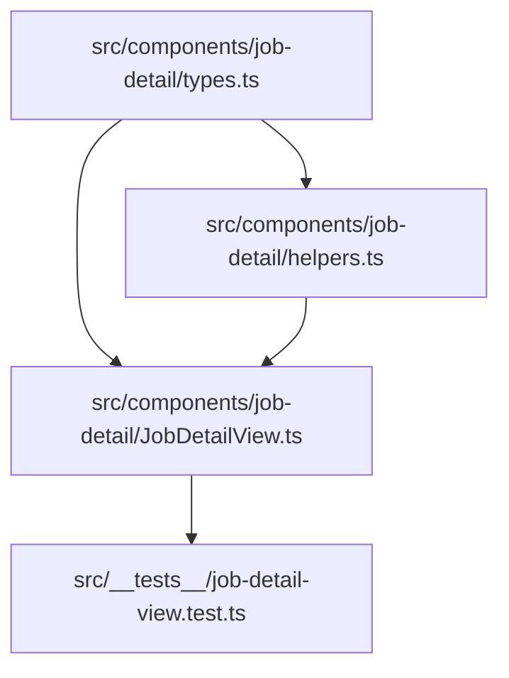

# Implementation Plan: FIEL-59 Single Screen Job Detail View Component

**Feature:** Single Screen Job Detail View (Steps, Evidence, Findings, Measurements, Timeline, Lightbox Overlay)  
**Jira Ticket:** [FIEL-59](https://sidsanadhaya.atlassian.net/browse/FIEL-59)  
**Date:** 2026-08-14  

---

## Component Dependency Graph



---

## Tasks & Phases

### Phase 1: Data Contracts & Utility Functions

#### Task 1: Create Job Detail Types (`src/components/job-detail/types.ts`)
- **File:** `src/components/job-detail/types.ts`
- **Description:** Define TypeScript interfaces for detailed job data, evidence, findings, measurements, steps, timeline, tabs, and props.

```typescript
export type JobDetailTab = 'overview' | 'steps' | 'findings' | 'measurements';

export interface EvidenceMedia {
  id: string;
  stepId: string;
  url: string;
  caption?: string;
  timestamp: string | Date;
}

export interface FindingItem {
  id: string;
  label: string;
  confidence: number; // 0.0 - 1.0
  isRiskFactor: boolean;
}

export interface MeasurementItem {
  id: string;
  label: string;
  value: number;
  unit: string;
  minRange: number;
  maxRange: number;
}

export interface ProcedureStepItem {
  id: string;
  title: string;
  status: 'COMPLETED' | 'SKIPPED' | 'OVERRIDDEN';
  notes?: string;
}

export interface TimelineEvent {
  timestamp: string | Date;
  event: string;
  actor: string;
}

export interface DetailedJobData {
  id: string;
  technicianName: string;
  jobType: string;
  status: string;
  riskScore: number;
  completedAt: string | Date;
  steps: ProcedureStepItem[];
  evidence: EvidenceMedia[];
  findings: FindingItem[];
  measurements: MeasurementItem[];
  timeline: TimelineEvent[];
}

export interface JobDetailViewProps {
  job: DetailedJobData;
  onClose?: () => void;
  onActionVerdict?: (jobId: string, verdict: 'ACCEPT' | 'REJECT' | 'REWORK') => void;
  defaultTab?: JobDetailTab;
}
```

#### Task 2: Create Measurement & Formatting Helpers (`src/components/job-detail/helpers.ts`)
- **File:** `src/components/job-detail/helpers.ts`
- **Description:** Implement `isMeasurementOutOfRange` and `formatConfidence`.

```typescript
import { MeasurementItem } from './types.js';

export function isMeasurementOutOfRange(item: MeasurementItem): boolean {
  return item.value < item.minRange || item.value > item.maxRange;
}

export function formatConfidence(confidence: number): string {
  const pct = Math.round(confidence * 100);
  return `${pct}%`;
}
```

---

### Phase 2: Job Detail View Controller Component & Tests

#### Task 3: Build Job Detail View Controller (`src/components/job-detail/JobDetailView.ts`)
- **File:** `src/components/job-detail/JobDetailView.ts`
- **Description:** Implement `JobDetailViewController` handling tab navigation, lightbox modal state (`openLightbox`, `closeLightbox`), supervisor verdict action callbacks, and HTML view rendering.

```typescript
import {
  DetailedJobData,
  EvidenceMedia,
  JobDetailTab,
  JobDetailViewProps,
} from './types.js';
import { formatConfidence, isMeasurementOutOfRange } from './helpers.js';

export class JobDetailViewController {
  private job: DetailedJobData;
  private activeTab: JobDetailTab;
  private activeLightboxImage?: EvidenceMedia;
  private onClose?: () => void;
  private onActionVerdict?: (
    jobId: string,
    verdict: 'ACCEPT' | 'REJECT' | 'REWORK'
  ) => void;

  constructor(props: JobDetailViewProps) {
    this.job = props.job;
    this.activeTab = props.defaultTab || 'overview';
    this.onClose = props.onClose;
    this.onActionVerdict = props.onActionVerdict;
  }

  public getActiveTab(): JobDetailTab {
    return this.activeTab;
  }

  public setActiveTab(tab: JobDetailTab): void {
    this.activeTab = tab;
  }

  public openLightbox(image: EvidenceMedia): void {
    this.activeLightboxImage = image;
  }

  public closeLightbox(): void {
    this.activeLightboxImage = undefined;
  }

  public getActiveLightboxImage(): EvidenceMedia | undefined {
    return this.activeLightboxImage;
  }

  public submitVerdict(verdict: 'ACCEPT' | 'REJECT' | 'REWORK'): void {
    if (this.onActionVerdict) {
      this.onActionVerdict(this.job.id, verdict);
    }
  }

  public renderHTML(): string {
    // Render tabs, steps, evidence, findings, measurements, timeline, and lightbox
    return `...`;
  }
}
```

#### Task 4: Write Unit & Component Test Suite (`src/__tests__/job-detail-view.test.ts`)
- **File:** `src/__tests__/job-detail-view.test.ts`
- **Description:** Unit test range evaluation, confidence formatting, tab switching, lightbox modal open/close, verdict submission, and HTML rendering.

---

## Checkpoints

- [ ] **Checkpoint 1:** Verify types & helper functions with unit tests
- [ ] **Checkpoint 2:** Verify JobDetailViewController tab switching, lightbox state, and verdict callbacks
- [ ] **Checkpoint 3:** Run `npm test` and `npm run build`
