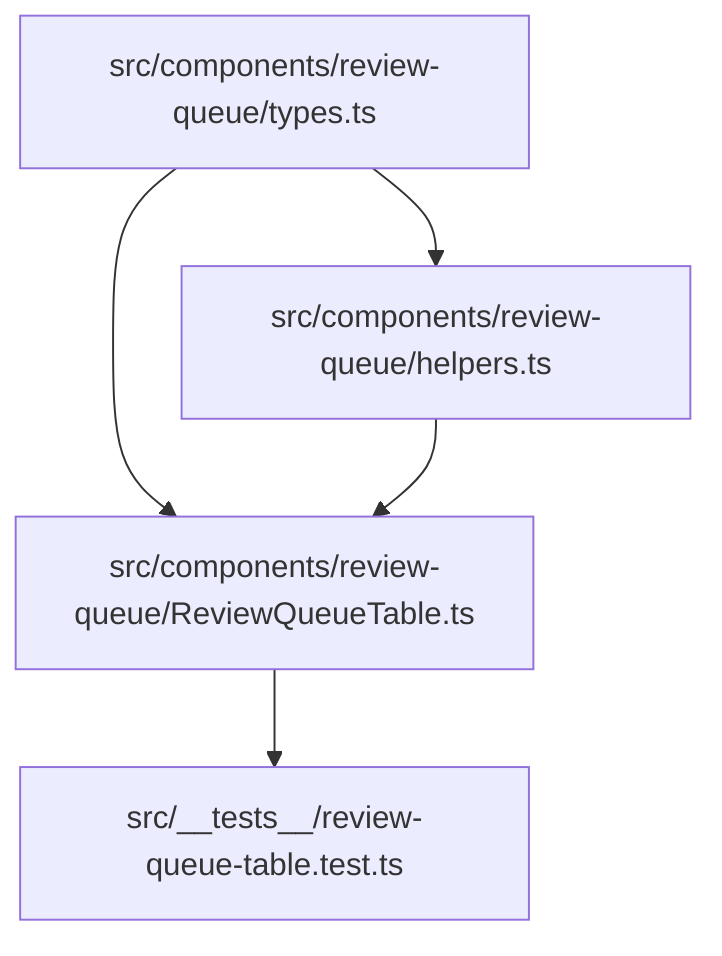

# Implementation Plan: FIEL-60 Review Queue Table Component

**Feature:** Review Queue Table with Sortable Columns & Risk Score Indicators  
**Jira Ticket:** [FIEL-60](https://sidsanadhaya.atlassian.net/browse/FIEL-60)  
**Date:** 2026-08-14  

---

## Component Dependency Graph



---

## Tasks & Phases

### Phase 1: Data Contracts & Helper Utilities

#### Task 1: Create Review Queue Types (`src/components/review-queue/types.ts`)
- **File:** `src/components/review-queue/types.ts`
- **Description:** Define TypeScript interfaces for table items, sortable columns, risk levels, and table props.

```typescript
export type SortDirection = 'asc' | 'desc';

export type SortableColumn =
  | 'technicianName'
  | 'jobType'
  | 'completedAt'
  | 'findingsCount'
  | 'overridesCount'
  | 'riskScore';

export type RiskLevel = 'HIGH' | 'MEDIUM' | 'LOW';

export interface ReviewQueueItem {
  id: string;
  technicianName: string;
  jobType: string;
  completedAt: string | Date;
  findingsCount: number;
  overridesCount: number;
  riskScore: number;
}

export interface ReviewQueueTableProps {
  jobs: ReviewQueueItem[];
  onSelectJob?: (jobId: string) => void;
  defaultSortColumn?: SortableColumn;
  defaultSortDirection?: SortDirection;
}
```

#### Task 2: Create Sorting & Risk Badge Helpers (`src/components/review-queue/helpers.ts`)
- **File:** `src/components/review-queue/helpers.ts`
- **Description:** Implement `getRiskLevel(score)` and `sortReviewQueueItems(items, column, direction)`.

```typescript
import { ReviewQueueItem, RiskLevel, SortableColumn, SortDirection } from './types.js';

export function getRiskLevel(score: number): RiskLevel {
  if (score >= 10) return 'HIGH';
  if (score >= 5) return 'MEDIUM';
  return 'LOW';
}

export function sortReviewQueueItems(
  items: ReviewQueueItem[],
  column: SortableColumn,
  direction: SortDirection
): ReviewQueueItem[] {
  return [...items].sort((a, b) => {
    let valA: any = a[column];
    let valB: any = b[column];

    if (valA instanceof Date) valA = valA.getTime();
    if (valB instanceof Date) valB = valB.getTime();

    if (typeof valA === 'string' && typeof valB === 'string') {
      const cmp = valA.localeCompare(valB);
      return direction === 'asc' ? cmp : -cmp;
    }

    if (valA < valB) return direction === 'asc' ? -1 : 1;
    if (valA > valB) return direction === 'asc' ? 1 : -1;
    return 0;
  });
}
```

---

### Phase 2: Review Queue Table Component & Test Suite

#### Task 3: Build Review Queue Table Component (`src/components/review-queue/ReviewQueueTable.ts`)
- **File:** `src/components/review-queue/ReviewQueueTable.ts`
- **Description:** Implement the interactive review queue table rendering data rows, column sorting state management, risk score badges, and row selection click handlers.

```typescript
import {
  ReviewQueueItem,
  ReviewQueueTableProps,
  SortableColumn,
  SortDirection,
} from './types.js';
import { getRiskLevel, sortReviewQueueItems } from './helpers.js';

export class ReviewQueueTableController {
  private jobs: ReviewQueueItem[];
  private currentSortColumn: SortableColumn;
  private currentSortDirection: SortDirection;
  private onSelectJob?: (jobId: string) => void;

  constructor(props: ReviewQueueTableProps) {
    this.jobs = props.jobs;
    this.currentSortColumn = props.defaultSortColumn || 'riskScore';
    this.currentSortDirection = props.defaultSortDirection || 'desc';
    this.onSelectJob = props.onSelectJob;
  }

  public getSortedJobs(): ReviewQueueItem[] {
    return sortReviewQueueItems(
      this.jobs,
      this.currentSortColumn,
      this.currentSortDirection
    );
  }

  public handleHeaderClick(column: SortableColumn): void {
    if (this.currentSortColumn === column) {
      this.currentSortDirection =
        this.currentSortDirection === 'asc' ? 'desc' : 'asc';
    } else {
      this.currentSortColumn = column;
      this.currentSortDirection = 'asc';
    }
  }

  public handleRowClick(jobId: string): void {
    if (this.onSelectJob) {
      this.onSelectJob(jobId);
    }
  }

  public getSortState(): { column: SortableColumn; direction: SortDirection } {
    return {
      column: this.currentSortColumn,
      direction: this.currentSortDirection,
    };
  }

  public renderHTML(): string {
    const sorted = this.getSortedJobs();
    const rows = sorted
      .map(
        (job) => `
        <tr data-job-id="${job.id}" class="queue-row">
          <td>${job.technicianName}</td>
          <td>${job.jobType}</td>
          <td>${new Date(job.completedAt).toISOString()}</td>
          <td>${job.findingsCount}</td>
          <td>${job.overridesCount}</td>
          <td><span class="badge badge-${getRiskLevel(job.riskScore).toLowerCase()}">${job.riskScore} (${getRiskLevel(job.riskScore)})</span></td>
        </tr>`
      )
      .join('');

    return `<table class="review-queue-table"><thead>...</thead><tbody>${rows}</tbody></table>`;
  }
}
```

#### Task 4: Unit & Component Tests (`src/__tests__/review-queue-table.test.ts`)
- **File:** `src/__tests__/review-queue-table.test.ts`
- **Description:** Test sorting behavior across all 6 columns, risk level threshold classification, toggle sorting state, and row click selection callbacks.

---

## Checkpoints

- [ ] **Checkpoint 1:** Verify types & helper functions with unit tests
- [ ] **Checkpoint 2:** Verify table controller & HTML rendering with unit tests
- [ ] **Checkpoint 3:** Run `npm test` and `npm run build`
