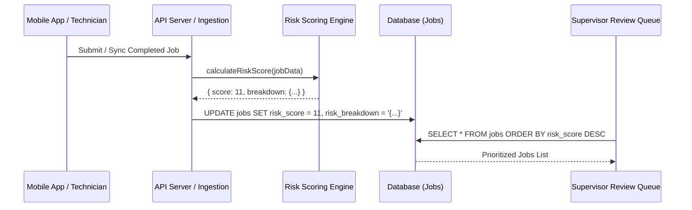

# Technical Design: Risk Scoring Algorithm for Job Prioritization (FIEL-53)

**Date:** 2026-08-14  
**Status:** Proposed  
**Jira Ticket:** [FIEL-53](https://sidsanadhaya.atlassian.net/browse/FIEL-53)  

---

## 1. Overview & Objectives

The goal of **FIEL-53** is to implement a deterministic risk scoring algorithm that evaluates completed field jobs during sync/submission and assigns a numeric risk score to prioritize high-risk jobs in the Supervisor Review Queue.

### Key Requirements
- Compute score using formula:
  $$\text{Score} = (\text{overrides} \times 3) + (\text{out\_of\_range} \times 2) + (\text{failed\_checks} \times 2) + (\text{is\_new\_procedure} \times 1)$$
- Sort queue in **descending order (`DESC`)** by risk score.
- Persist both total `risk_score` and detailed `risk_breakdown` on the `Job` record.
- Fast execution with zero external runtime overhead.

---

## 2. Architecture & Data Flow



---

## 3. Data Model & Contract

### TypeScript Interfaces

```typescript
export interface RiskFactors {
  overridesCount: number;       // Weight: 3
  outOfRangeCount: number;      // Weight: 2
  failedChecksCount: number;    // Weight: 2
  isNewProcedure: boolean;      // Weight: 1 (1 if true, 0 if false)
}

export interface RiskFactorWeights {
  overridesWeight: number;      // Default: 3
  outOfRangeWeight: number;     // Default: 2
  failedChecksWeight: number;   // Default: 2
  newProcedureWeight: number;   // Default: 1
}

export interface RiskScoreBreakdown {
  overridesPoints: number;
  outOfRangePoints: number;
  failedChecksPoints: number;
  newProcedurePoints: number;
}

export interface RiskCalculationResult {
  score: number;
  breakdown: RiskScoreBreakdown;
  factors: RiskFactors;
}
```

### Default Weight Constants

```typescript
export const DEFAULT_RISK_WEIGHTS: RiskFactorWeights = {
  overridesWeight: 3,
  outOfRangeWeight: 2,
  failedChecksWeight: 2,
  newProcedureWeight: 1,
};
```

---

## 4. Scoring Algorithm Implementation Logic

```typescript
export function calculateRiskScore(
  factors: RiskFactors,
  weights: RiskFactorWeights = DEFAULT_RISK_WEIGHTS
): RiskCalculationResult {
  const overridesCount = Math.max(0, factors.overridesCount || 0);
  const outOfRangeCount = Math.max(0, factors.outOfRangeCount || 0);
  const failedChecksCount = Math.max(0, factors.failedChecksCount || 0);
  const newProcedurePoint = factors.isNewProcedure ? 1 : 0;

  const overridesPoints = overridesCount * weights.overridesWeight;
  const outOfRangePoints = outOfRangeCount * weights.outOfRangeWeight;
  const failedChecksPoints = failedChecksCount * weights.failedChecksWeight;
  const newProcedurePoints = newProcedurePoint * weights.newProcedureWeight;

  const totalScore =
    overridesPoints +
    outOfRangePoints +
    failedChecksPoints +
    newProcedurePoints;

  return {
    score: totalScore,
    breakdown: {
      overridesPoints,
      outOfRangePoints,
      failedChecksPoints,
      newProcedurePoints,
    },
    factors: {
      overridesCount,
      outOfRangeCount,
      failedChecksCount,
      isNewProcedure: factors.isNewProcedure,
    },
  };
}
```

---

## 5. Database Schema & Indexing

### SQL Migration Strategy
```sql
ALTER TABLE jobs 
ADD COLUMN IF NOT EXISTS risk_score INT NOT NULL DEFAULT 0,
ADD COLUMN IF NOT EXISTS risk_breakdown JSONB DEFAULT '{}'::jsonb;

-- B-Tree Index on risk_score DESC for fast supervisor queue sorting
CREATE INDEX IF NOT EXISTS idx_jobs_risk_score_desc ON jobs (risk_score DESC);
```

---

## 6. Verification & Testing Plan

### Unit Test Cases
1. **Zero Risk Base Case:** All counts = 0, isNewProcedure = false => `score = 0`.
2. **Standard Weighted Formula Case:** 2 overrides (6), 1 out-of-range (2), 3 failed checks (6), newProcedure = true (1) => `score = 15`.
3. **Negative Input Handling:** Negative counts sanitized to 0.
4. **Custom Weights Override:** Test overriding standard coefficients via `RiskFactorWeights`.
5. **Sort Order Order Verification:** Array of jobs with various risk scores sorted in DESC order.
